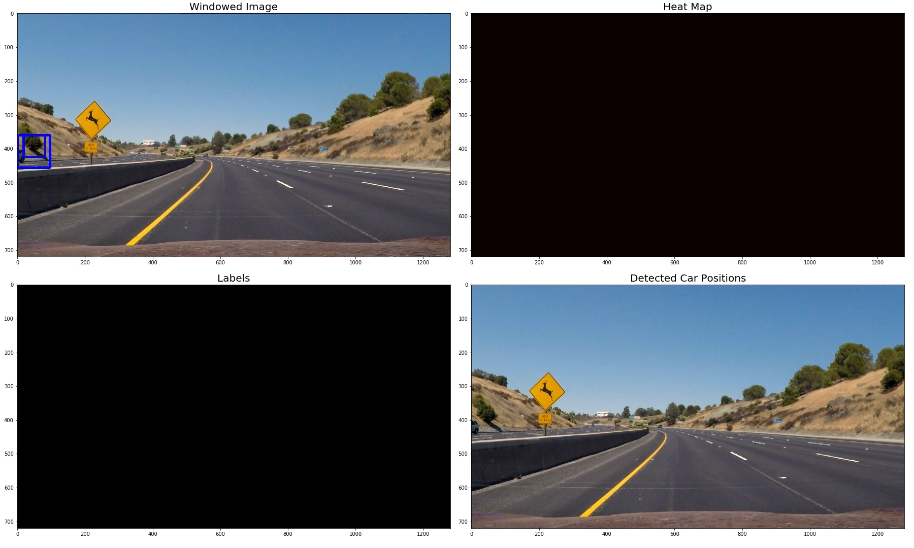
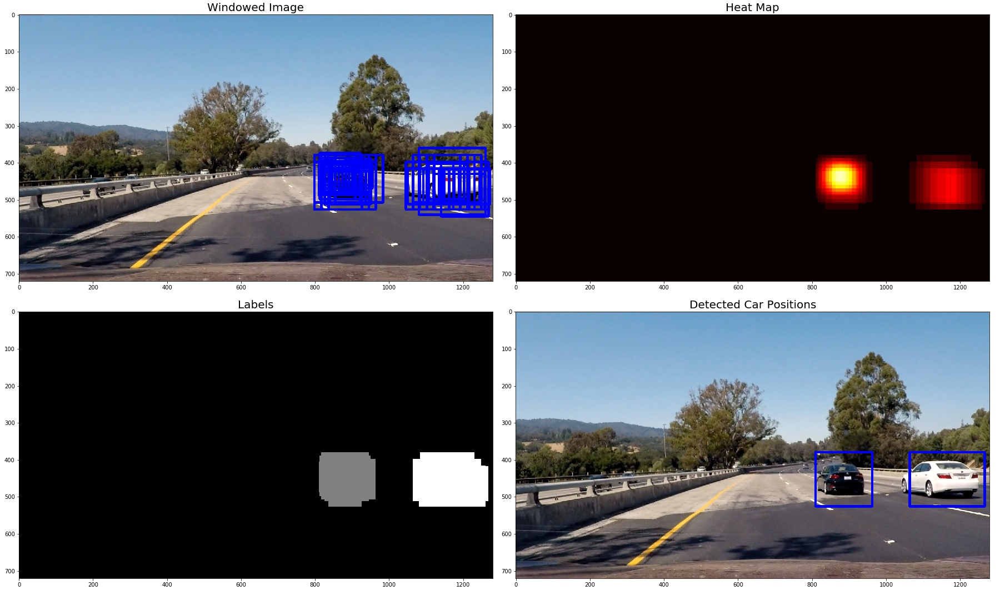

**Vehicle Detection Project**

The goals / steps of this project are the following:

* Perform a Histogram of Oriented Gradients (HOG) feature extraction on a labeled training set of images and train a classifier Linear SVM classifier
* Optionally, you can also apply a color transform and append binned color features, as well as histograms of color, to your HOG feature vector. 
* Note: for those first two steps don't forget to normalize your features and randomize a selection for training and testing.
* Implement a sliding-window technique and use your trained classifier to search for vehicles in images.
* Run your pipeline on a video stream (start with the test_video.mp4 and later implement on full project_video.mp4) and create a heat map of recurring detections frame by frame to reject outliers and follow detected vehicles.
* Estimate a bounding box for vehicles detected.

I have 2 solutions provided in 2 IPython notebooks. Both are almost the same except for the following difference:

1. `CarDetection_M1.py` 
    - Extracts HOG features for every (sliding) window of the image.
    - Extremely slow.
    
2. `CarDetection_M2.py`
    - Extracts HOG features only once for an image. (HOG sub-sampling window search)
    - Comparatively faster but slow nevertheless.
    - This method is used to generate the final `project_video_output_final.mp4` video.

### Histogram of Oriented Gradients (HOG)


The code for this step is contained in the fourth code cell of the `CarDetection_M1.ipynb` IPython notebook. I made use of the hog API from scikit-image library.

I started by reading in all the `vehicle` and `non-vehicle` images.

I then explored different color spaces and different `skimage.hog()` parameters (`orientations`, `pixels_per_cell`, and `cells_per_block`).  I grabbed random images from each of the two classes and displayed them to get a feel for what the `skimage.hog()` output looks like.

Here is an example using the `YUV` color space and HOG parameters of `orientations=8`, `pixels_per_cell=(8, 8)` and `cells_per_block=(2, 2)` for a `vehicle` and `non-vehicle` image example:


I tried various combinations of parameters and extracted the features from the images. Then I trained a Support Vector Machine with `rbf` kernal on the data. I noticed the performance of the classifier on features extracted for various parameters. Finally chose the one with highest classification accuracy. 

```
colorspace = 'YUV'
orient = 9
pix_per_cell = 8
cell_per_block = 2
hog_channel = 'ALL'
spatial_size = (16, 16) 
hist_bins = 16 
```


Feature extraction is done in the method `extract_features()` in cell 8 of `CarDetection_M1.ipynb` IPython notebook. I extract the `histogram of colors`, `binned color features` and `histogram of gradients` from an image and concatinate them to have features as a 1-d array. Once the features are extracted from all the images, I randomly split the data into training and test set. I fit a standard scalar (from scikit-learn) on the training set and use it transform both the training and test datasets.
Finally I trained a `Support Vector Machine` binary classifier with `rbf` kernel. I use `rbf` kernal in order to find a non-linear decision boundary. Then I evaluated the trained model on the test set.

The accuracy achieved was more than `99%` on the test set.

### Sliding Window Search

As I have mentioned in the begining, I used two methods to implement the sliding window search, as explained in the lessons.

Note: 
1. The window search is always applied to the lower half of the images.
2. The features extracted on the window section of images are scaled using the same StandardScaler fitted on the training set.

Method 1: 

Extract the HOG features for each sliding window of the image. Since the windows overlap, we end up extract the same features several times resulting in poor execution performance.

I played aroung with different sizes of windows, overlaps ratio and sections of image to scan. Finally choose with following:

| Windows        | Size  (x,y)  |       Overlap  |
|:-------------:|:-------------:|:-------------:| 
| small      | (64, 64)       |    (0.85, 0.85) |
| medium      | (96, 96)       |  (0.85, 0.85) |
| large     | (128, 128)      |   (0.85, 0.85)  |
| huge      | (int(image_height // 4), int(image_height // 4)) | (0.5, 0.5) |

Method 2: (HOG sub-sampling window search)
 
In this method, I extract the HOG features only once per image and later sample it for each sliding window.
Finalised parameters are

```
 ystart = int(height // 2)
 ystop = height - 100
 scale = [1.75, 2]
```

Ultimately I searched on two scales using YUV 3-channel HOG features plus spatially binned color and histograms of color in the feature vector, which provided a nice result. Since, the `vehicles` are idenfied by mulitple overlapping windows, we need to choose the most suitable. Also, we need to get rid of the false positives. For this we apply heat map on the region where the `vehicle` (or the `vehicle` like object) is found and then apply thresholding

Here are the output for all the test images. These images show the initial identification of the `Vehicles` in multiple windows. Then the `Heat Map` applied to these regions and thresholded. 3 sub-image is the result of applying `label` function (from scipy.ndimage.measurements) and the last one is the final image with all the `vehicles` (hopefully) identified and a box drawn arond it.

Test 1:


Test 2:



Test 3:


Test 4:



Test 5:


Test 6:


---

### Video Implementation

Here's a [link to my video result](./output_videos/project_video_output_final.mp4)


I recorded the positions of positive detections in each frame of the video.  From the positive detections I created a heatmap and then thresholded that map to identify vehicle positions.  I then used `scipy.ndimage.measurements.label()` to identify individual blobs in the heatmap.  I then assumed each blob corresponded to a vehicle.  I constructed bounding boxes to cover the area of each blob detected.  


The code for the above can be foound in the cell `22` of the `CarDetection_M1.ipynb` IPython notebook.
 
---

### Discussion

In my case, the `Method 1` for sliding window search performed better in terms of detection the vehicles but it is too slow to run on the video. `Method 2` is faster but is its performance in detecting vehicles was comparatively lower.

The first part of the project, training the classifier is pretty straight forward and I did not face any issues. For the second part, a much faster implementation would be better. I would train a deep neural network model to detect the vehicles for further improving the project. One well defined method I would apply is YOLOv2 model.


